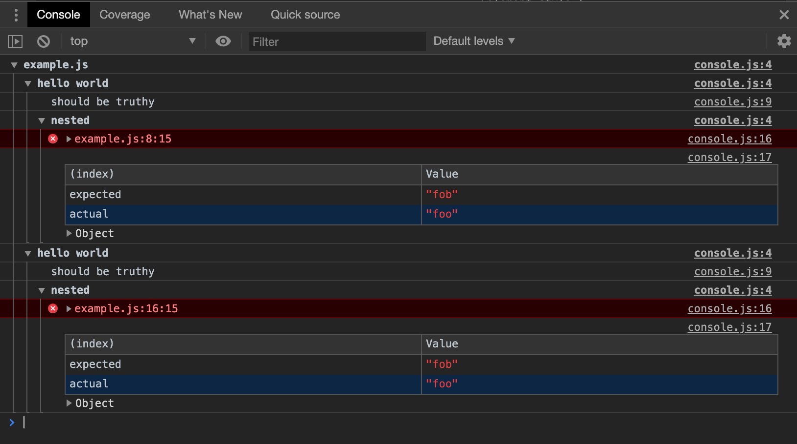

# zora-console-reporter

Reporters using the console API, should work in bot environment the browser and Nodejs

## installation

``npm run install zora-console-reporter`` 

## raw

Stringify zora's messages in the console. It is particularly useful if you want to automate a browser and use some DevTool protocol. Note: it won't stop on Bailout

## console

Uses advanced console API to group and flag messages. Ideal to use in the browser which provides many way to interact with the console logs (filter, expand, etc)

 
